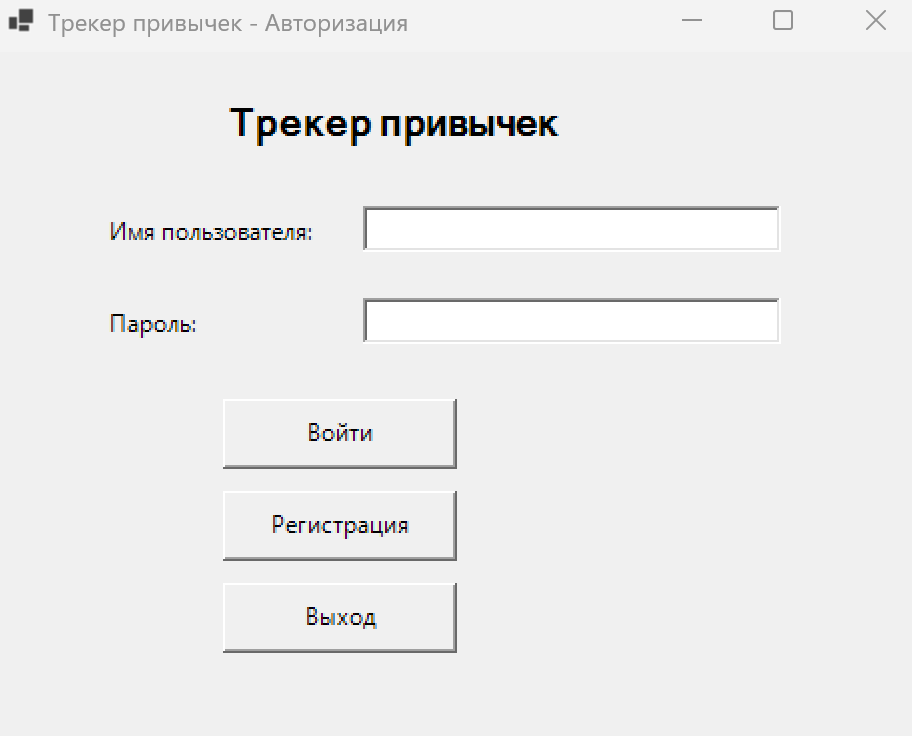
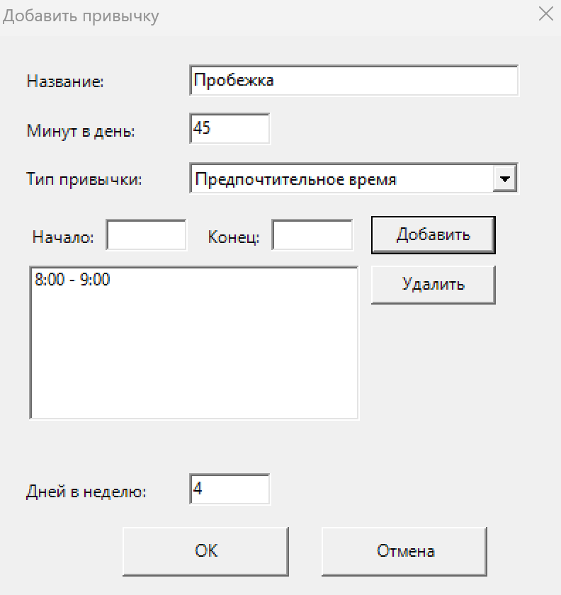
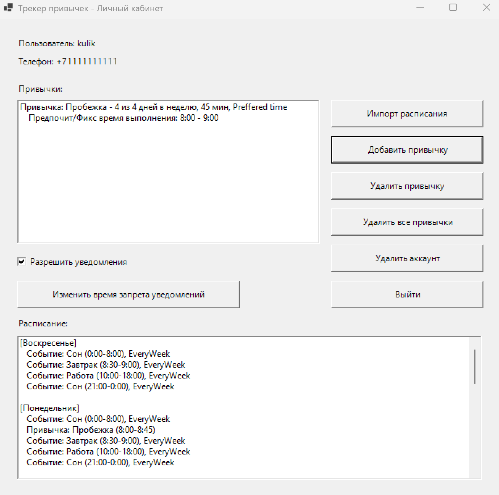

# Сервис формирования привычек на основе имеющегося расписания
### Проблема клиента:
Вырабатывать привычки с нуля самому трудно, при этом гораздо проще пройти самый трудный этап формирования привычки если появляется внешний контроль, например напоминания (пример – Duolingo с пассивно-агрессивными напоминаниями о важности каждодневных занятий) или конкретная ячейка в расписании клиента, реализующая привычку. Решение проблемы – использование программ-ассистентов, осуществляющих некий внешний контроль над выполнением привычек.
### Описание программы: 
Пользователь вводит свое расписание на неделю и привычки, которые ему нужно соблюсти. Привычки распределяются по свободным слотам расписания с учетом указанных пользователем параметров: предпочтительного времени выполнения (какие-то привычки удобнее выполнять, например утром, какие-то нужно выполнять в жестко определенном временном интервале), сколько дней в неделю нужно выполнять, сколько времени требуется на выполнение.
### Функциональные требования:
1) Регистрация пользователя: пользователь могжет зарегистрироваться в приложении по уникальному имени пользователя, номеру телефона и паролю.
2) Авторизация пользователя: пользователь может авторизоваться по своему имени пользователя и паролю.
3) Уведомления о выполнении привычек: пользователь может авторизоваться в телеграмм-боте по имени пользователя и паролю для получения уведомлений о предстоящих привычках.
4) Настройка уведомлений: пользователь может настроить в приложении время запрета посылки уведомлений о привычках, может отключить уведомления.
5) Добавление недельного расписания: пользователь может импортировать свое расписание из файла .ics (формат гугл календаря) со следующими типами событий: еженедельные, каждые две недели, единовременные.
6) Привычки: пользователь может добавлять привычки, удалять выбранные привычки, удалять все привычки.
7) Формат данных для привычки: название, количество минут на выполнение, сколько дней в неделю требуется выполнять, тип времени (безразличное, фиксированное, предпочтительное); для фиксированного и предпочтительного времени пользователь должен добавить >=1 интервалов времени, в которые он хочет выполнять привычку.
### Распределение привычек:
* сначала распределяются привычки, для которых указан жесткий временной интервал выполнения
* далее распределяются привычки с предпочтительным временным интервалом выполнения
* по остаточному принципу распределяются привычки без предпочтительного интервала выполнения
### Use-case диаграмма:

### User-flow диаграмма:

### BPMN диаграмма:

### ER диаграмма сущностей:

### Диаграмма компонентов:

### Диаграмма БД:

### Технологический стек бекенда:
* Язык C#
* Entity Framework для компонента доступа к данным
* Serilog для логгирования
* Telegram.Bot для отправки сообщений
* PostgreSQL - СУБД
* xUnit для модульного, интеграционного и e2e тестирования
### Технологический стек фронтенда:
* WinForms для GUI - пока что только desktop
### Черновые варианты интерфейса

